# aws-ec2-apache-web-server
Deployed and managed an Apache Web Server on AWS EC2 using Amazon Linux, SSH, Security Groups and Linux Administration.
# 🚀 Cloud-Based Web Server Deployment Using AWS EC2 and Apache


---

## 📌 Project Overview

This project demonstrates the deployment of a static website on AWS EC2 using Apache HTTP Server running on Amazon Linux 2023.

The primary objective was to gain practical experience in:

- AWS EC2 Instance Management
- Linux Administration
- SSH Connectivity
- Apache Web Server Deployment
- Security Group Configuration
- Networking Fundamentals
- Website Hosting

---

## 🏗️ Architecture

```text
Internet
    │
    ▼
AWS Security Group
(Port 22, Port 80)
    │
    ▼
EC2 Instance
(Amazon Linux 2023)
    │
    ▼
Apache HTTP Server
    │
    ▼
Static Website
```

---

## 🛠️ Technologies Used

- AWS EC2
- Amazon Linux 2023
- Apache HTTP Server (httpd)
- SSH
- Linux Commands
- Security Groups
- Networking

---

## ⚙️ Implementation Steps

### Step 1: Created EC2 Instance

- Amazon Linux 2023
- t2.micro Instance
- SSH Key Pair Authentication

### Step 2: Configured Security Group

Allowed inbound traffic:

| Protocol | Port |
|-----------|--------|
| SSH | 22 |
| HTTP | 80 |

### Step 3: Connected to EC2 using SSH

```bash
ssh -i dhanu-key.pem ec2-user@<public-ip>
```

### Step 4: Updated Linux Packages

```bash
sudo dnf update -y
```

### Step 5: Installed Apache Web Server

```bash
sudo dnf install httpd -y
```

### Step 6: Started Apache Service

```bash
sudo systemctl start httpd
sudo systemctl enable httpd
```

### Step 7: Created and Hosted Website

Website files were deployed under:

```bash
/var/www/html
```

### Step 8: Verified Deployment

- Website accessible through browser
- Apache service running successfully
- Port 80 listening
- Access logs generated

---

# 📸 Project Screenshots

## EC2 Instance Running

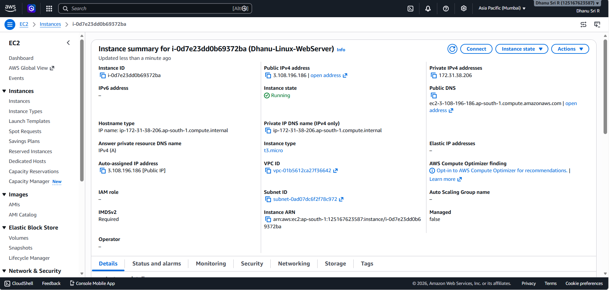

---

## Security Group Configuration

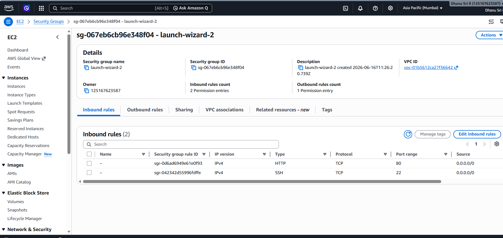

---

## SSH Login

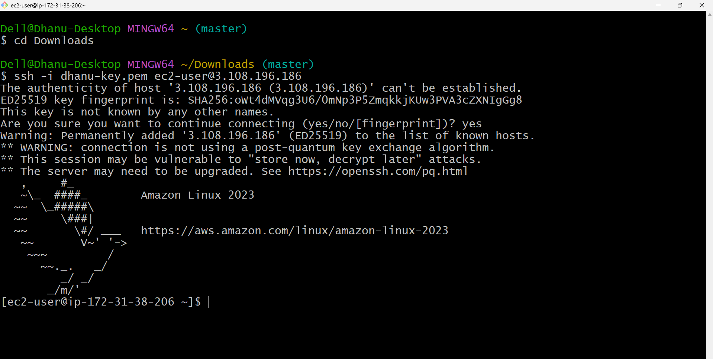

---

## Linux Server Information

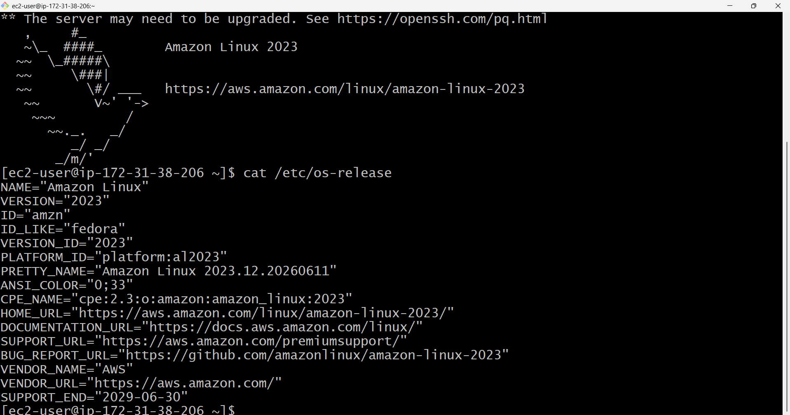

---

## Apache Installation

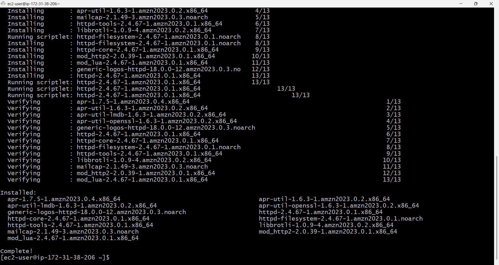

---

## Apache Service Running

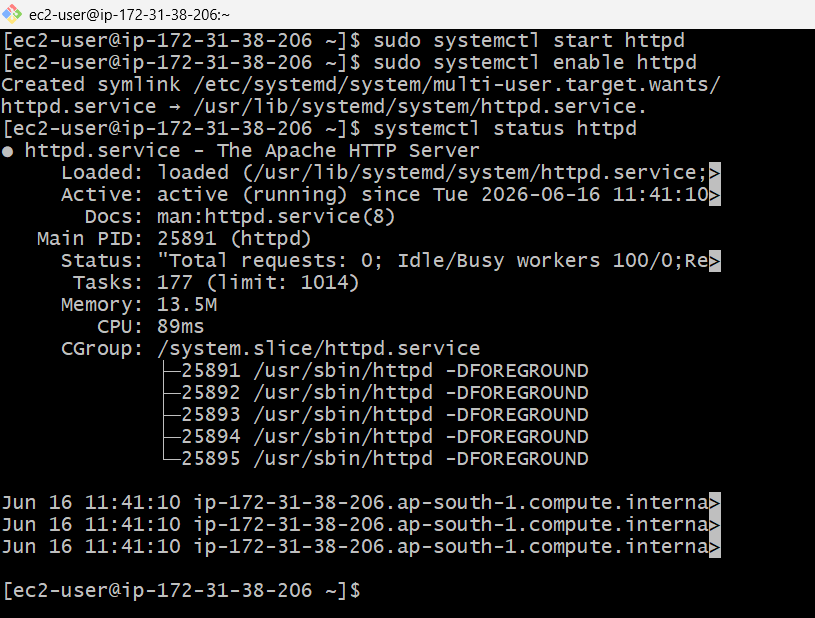

---

## Website Files

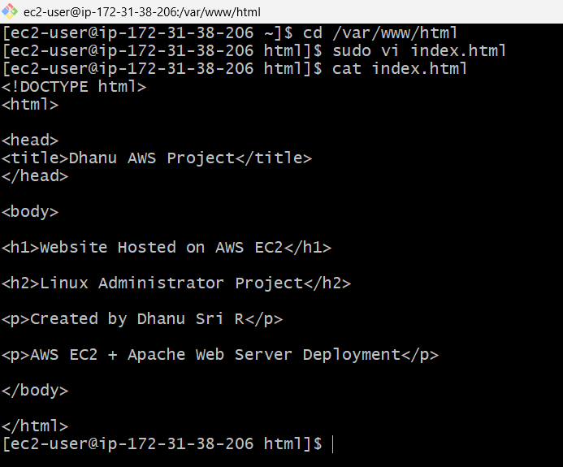

---

## Live Website

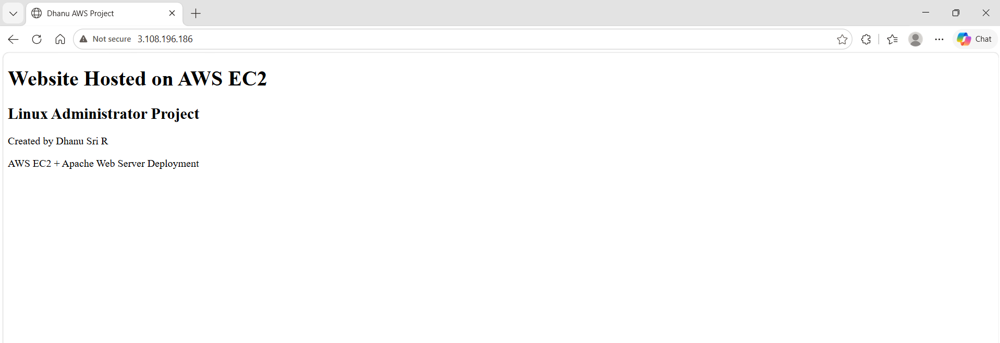

---

## Website Verification from CLI

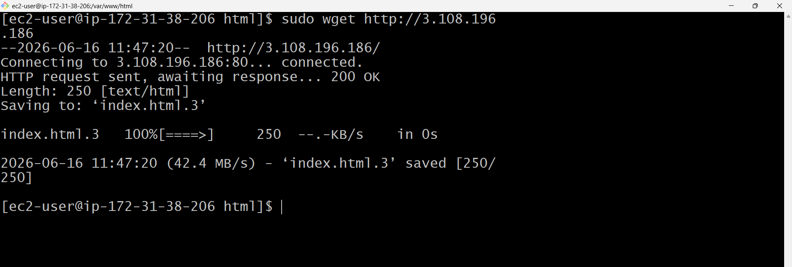

---

## Apache Access Logs

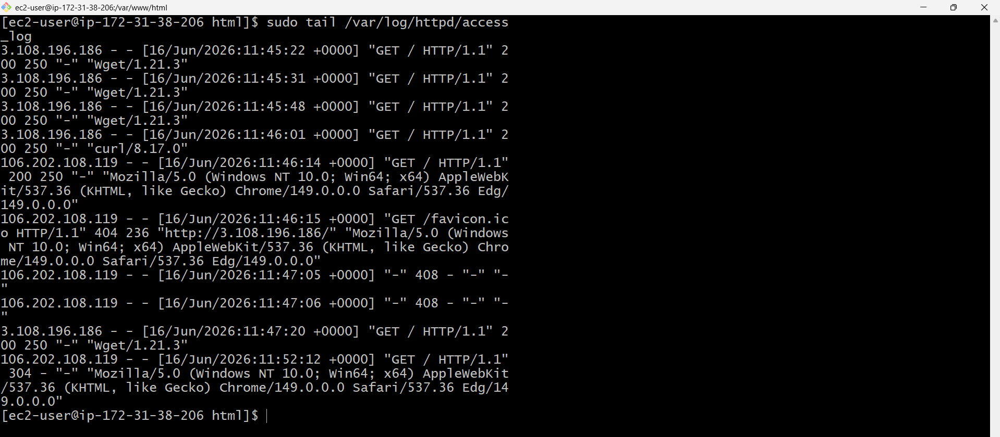

---

## Open Ports Verification

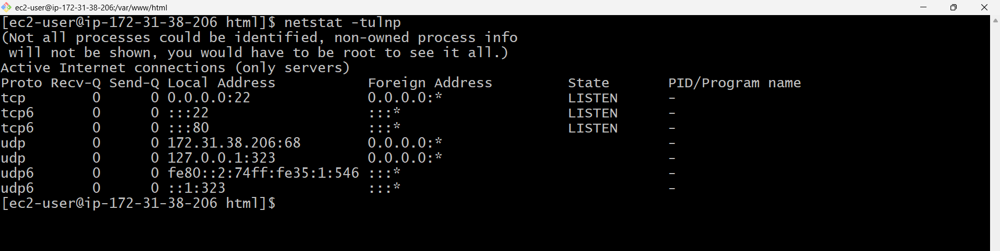

---

## 🔍 Verification Commands

Check Apache Service Status:

```bash
systemctl status httpd
```

Check Listening Ports:

```bash
ss -tulnp
```

View Apache Access Logs:

```bash
sudo tail /var/log/httpd/access_log
```

---

## 🎯 Key Learnings

- AWS EC2 Deployment
- Linux System Administration
- SSH Authentication
- Apache Web Server Management
- Security Group Configuration
- Networking and Port Management
- Website Hosting
- Access Log Monitoring

---

## 🚀 Future Enhancements

- HTTPS Configuration using SSL/TLS
- Domain Integration using Route 53
- Load Balancer Configuration
- Docker Container Deployment
- CI/CD Integration

---

## 👩‍💻 Author

### Dhanu Sri R

**LinkedIn:**  
https://www.linkedin.com/in/dhanu-sri-r-846655398/

**GitHub:**  
https://github.com/Dhanu-Kotari

---
